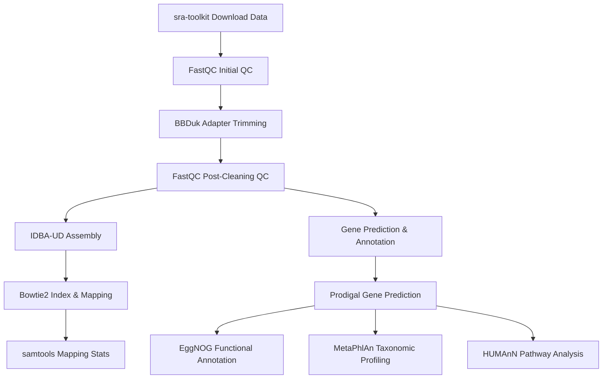

# Metagenomic Bioinformatics Analysis 
## Overview

This pipeline processes metagenomic sequencing data, starting from raw reads to functional annotation. Key steps include quality control, assembly, gene prediction, taxonomic profiling, and functional analysis using various bioinformatics tools.


### Main Steps:  
1. **Download Data**: Retrieve SRA files using `prefetch` and convert to FASTQ with `fastq-dump`.  
2. **Quality Control**:  
   - Initial QC with `FastQC`.  
   - Adapter trimming and quality filtering using `BBDuk`.  
   - Post-cleaning QC with `FastQC`.  
3. **Assembly**: Merge reads and perform de novo assembly with `IDBA-UD`.  
4. **Mapping**: Index assembly and map reads using `Bowtie2`, followed by sorting and statistics with `samtools`.  
5. **Gene Prediction**: Identify genes using `Prodigal`.  
6. **Functional Annotation**:  
   - EggNOG annotation via `emapper.py`.  
   - Taxonomic profiling with `MetaPhlAn`.  
   - Pathway analysis using `HUMAnN3`.  

---

## Flowchart  


---

## Requirements  
- Tools: `SRA Toolkit`, `FastQC`, `BBTools`, `IDBA-UD`, `Bowtie2`, `samtools`, `Prodigal`, `EggNOG-mapper`, `MetaPhlAn`, `HUMAnN3`.  
- Environment: A Conda environment named `your_env_name` (update in script).  
- Resources: Adapter file for BBDuk (update path in script).  

---

## Usage  
1. **Configure Paths**:  
   - Update `WORKDIR`, Conda environment name, and BBDuk adapter path in `source_code.sh`.  
   - Ensure `test_list.txt` contains valid SRA accession numbers.  

2. **Run Entire Pipeline**:  
   ```bash
   bash source_code.sh
   ```

---

## Troubleshooting  
If the pipeline fails, run commands step-by-step:  

### 1. Download Data  
```bash
prefetch $sample -O $RAW_READS_DIR  
fastq-dump --gzip --split-3 -O $RAW_READS_DIR $RAW_READS_DIR/$sample/${sample}.sra  
```

### 2. Quality Control  
```bash
fastqc -f fastq -t $THREADS ${r1} -o $QC_DIR/initial  
fastqc -f fastq -t $THREADS ${r2} -o $QC_DIR/initial  
bbduk.sh in=${r1} in2=${r2} out=${c1} out2=${c2} qtrim=rl trimq=20 mlf=0.33 threads=$THREADS ref="/path/to/adapters.fa"  
fastqc -f fastq -t $THREADS ${c1} -o $QC_DIR/final  
fastqc -f fastq -t $THREADS ${c2} -o $QC_DIR/final  
```

### 3. Assembly  
```bash
fq2fa --merge --filter $CLEANED_DIR/${sample}_clean_R1.fastq $CLEANED_DIR/${sample}_clean_R2.fastq $CLEANED_DIR/${sample}_clean.fa  
idba_ud -r $CLEANED_DIR/${sample}_clean.fa -o $ASSEMBLY_DIR/$sample  
```

### 4. Mapping  
```bash
bowtie2-build --threads $THREADS $ASSEMBLY_DIR/${sample}/contig.fa $MAPPING_DIR/${sample}_contig_index  
bowtie2 -x $MAPPING_DIR/${sample}_contig_index -1 $c1 -2 $c2 -S $MAPPING_DIR/${sample}_mapped.sam --threads $THREADS --no-unal --sensitive --dovetail  
samtools view -@ $THREADS -bS $MAPPING_DIR/${sample}_mapped.sam | samtools sort -@ $THREADS -o $MAPPING_DIR/${sample}_mapped_sorted.bam  
samtools flagstat $MAPPING_DIR/${sample}_mapped_sorted.bam > $MAPPING_DIR/${sample}_mapping_stats.txt  
```

### 5. Gene Prediction & Annotation  
```bash
prodigal -p meta -i $ASSEMBLY_DIR/${sample}/contig.fa -a $GENE_DIR/${sample}.faa -d $GENE_DIR/${sample}.fna -o $GENE_DIR/${sample}.gff -f gff -q  
emapper.py -i $GENE_DIR/${sample}.faa -o $EGGNOG_DIR/${sample}  
```

### 6. Taxonomic & Functional Profiling  
```bash
metaphlan $c1,$c2 --input_type fastq --bowtie2out $MPA_DIR/${sample}_metaphlan_bowtie2.bz2 -o $MPA_DIR/${sample}_metaphlan_profile.tsv --nproc $THREADS --tax_lev 's'  
humann --input $CLEANED_DIR/${sample}_clean_cb.fastq.gz --output $HUMANN_DIR --threads $THREADS --input-format fastq.gz --o-log $HUMANN_DIR/${sample}_humann3.log  
```

---

## Notes  
- Check intermediate files (e.g., `.sam`, `.bam`, `.fa`) to identify failing steps.  
- Ensure sufficient storage and memory for large datasets.  
- Update thread counts (`THREADS`) based on your system.
